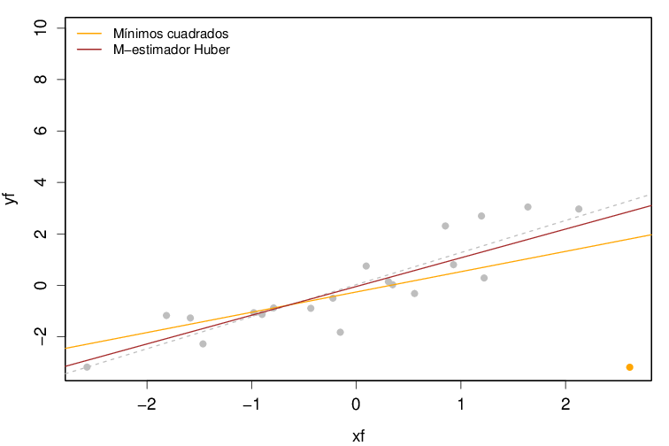

# Animated leverage

## Animación do apalancamento sobre unha regresión lineal

Eduardo Corbelle Rico, setembro de 2015

Este proxecto utiliza R para crear unha animación do efecto de apalancamento dun punto respecto dunha regresión lineal. O proxecto xenera tres tipos de animacións:

* Efecto dun punto situado aproximadamente no centro do grupo
* Efecto dun punto situado no extremo
* Efecto dun punto situado no extremo, comparado coa regresión mediante o M-estimador de Huber

O ficheiro Diapos.pdf é un exemplo do resultado da animación utilizando LaTeX e beamer. A animación pódese apreciar cando se abre no Acrobat Reader de Adobe.